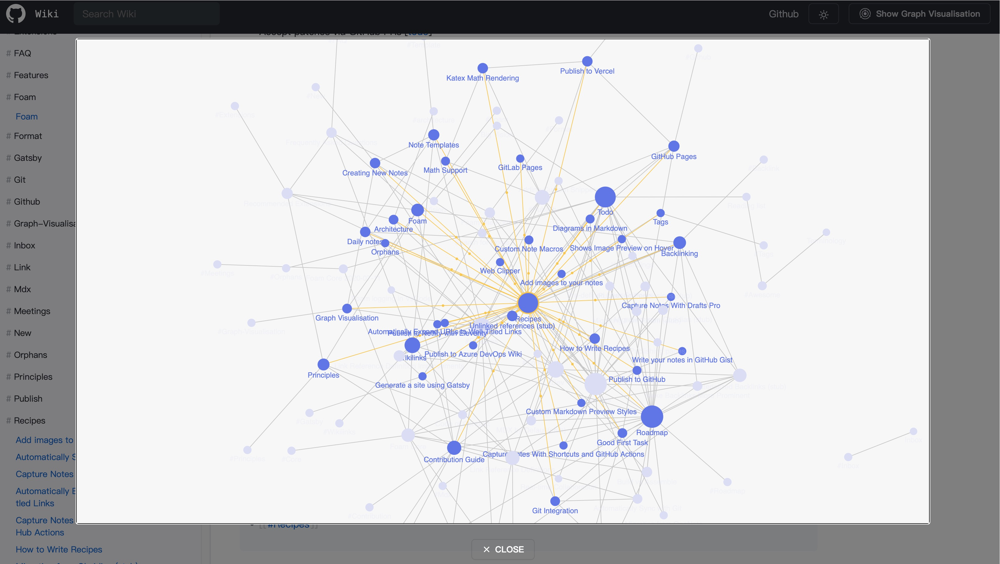
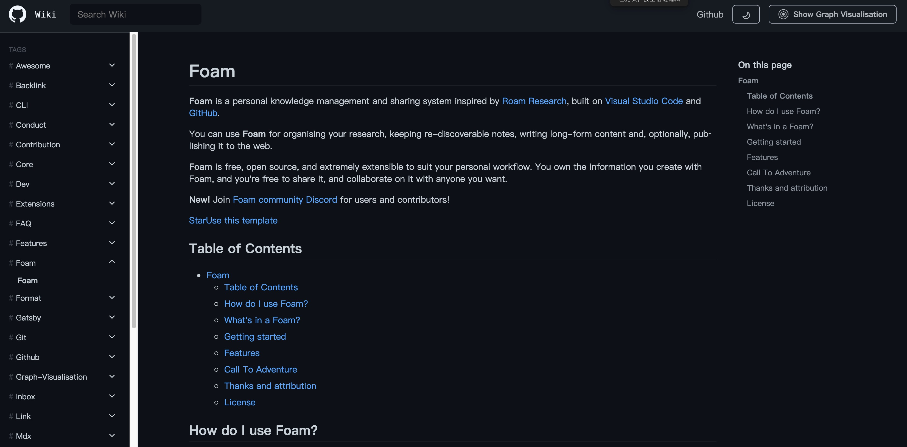

# Gatsby Theme Primer Wiki

A Gatsby Theme for Wiki/Docs/Knowledge Base, which using [Primer style](https://primer.style/react/) as the UI theme, can work well with [Foam](https://github.com/foambubble/foam) or [Obsibian](https://obsidian.md/) or just markdown files.

This theme is inspired with [gatsby-project-kb](https://github.com/hikerpig/gatsby-project-kb), [gatsby-digital-garden](https://github.com/mathieudutour/gatsby-digital-garden) and [doctocat](https://primer.style/doctocat/)

## Sites that use this theme

- [Demo](https://demo-wiki.owenyoung.com) - ([Source](https://github.com/theowenyoung/gatsby-theme-primer-wiki/tree/main/example))
- [Everything I Know by Owen](https://wiki.owenyoung.com/) - ([Source](https://github.com/theowenyoung/wiki))
- [Foam Demo](https://demo-foam.owenyoung.com/) - ([Source](https://github.com/theowenyoung/foam-template-gatsby-theme-primer-wiki))
- [Obsidian Demo](https://demo-obsidian.owenyoung.com/) - ([Source](https://github.com/theowenyoung/obsidian-template-gatsby-theme-primer-wiki))
- [Gatsby Starter Demo](https://demo-gatsby-starter-primer-wiki.owenyoung.com/) - ([Source](https://github.com/theowenyoung/gatsby-starter-primer-wiki))

## Features

- Support Local search, full-text search.
- SEO Optimization
- Support Graph Visualisation with Canvas.
- Support Tags, Tags First, Generating tag pages, also connecting with graph visualisation.
- Support [Gitbook](https://docs.gitbook.com/integrations/github/content-configuration#summary) styled `SUMMARY.md` for custom sidebar.
- Support `[[WikiLink]]`
- Support Light/Dark Theme
- Custom Header Nav Items
- Nested Sidebar
- Support Prefix Path
- Support Draft Post

## Principles

Here are my main ideas/principles in designing this theme.

1. No vendor lock-in. The less vendor features you use, the better you'll be able to migrate. `[[Wikilink]]` is the only non-markdown feature supported by default, but nonetheless, it is recommended to use the standard markdown syntax, or if you edit with [Foam](https://github.com/foambubble/foam), please use [Wikilink](https://foambubble.github.io/foam/wikilinks) with [Link Reference Definitions](https://foambubble.github.io/foam/features/link-reference-definitions). That give us the capability change our theme, or hosted place.
2. Use meta data instead of special characters. We should use `tags` as the document's metadata, not `#tag` in the plain text.
3. Use tags instead of categories. Minimal subfolders.

## Getting Started

### With Foam template repo

See [foam-template-gatsby-theme-primer-wiki](https://github.com/theowenyoung/foam-template-gatsby-theme-primer-wiki)

### With the Obsidian template repo

See [obsidian-template-gatsby-theme-primer-wiki](https://github.com/theowenyoung/obsidian-template-gatsby-theme-primer-wiki)

### With the Gatsby starter

See [gatsby-starter-primer-wiki](https://github.com/theowenyoung/gatsby-starter-primer-wiki)

### Manual

```bash
npm i gatsby-theme-primer-wiki
```

## Usage

### Theme Config

Edit `gatsby-config.js`

> If you use foam template, edit `.layouts/gatsby-config.js`

Example:

```javascript
    {
      resolve: "gatsby-theme-primer-wiki",
      options: {
        sidebarDepth: 0,
        nav: [
          {
            title: "Github",
            url: "https://github.com/theowenyoung/gatsby-theme-primer-wiki",
          },
        ],
        editUrl: `https://github.com/theowenyoung/gatsby-theme-primer-wiki/tree/main/`,
      },
    },
```

A valid config can be found [here](https://github.com/theowenyoung/gatsby-theme-primer-wiki/blob/main/example/gatsby-config.js)

### nav

For header navs. Support two depth levels. Example:

```javascript
{
  nav: [
    {
      title: "Github",
      url: "https://github.com",
    },
    {
      title: "Menus",
      items: [
        {
          title: "Menu1",
          url: "https://google.com",
        },
      ],
    },
  ];
}
```

### editUrl

You remote git repo url prefix.

### mdxOtherwiseConfigured

Advanced, use your own mdx plugin config, See https://github.com/theowenyoung/gatsby-theme-primer-wiki/blob/main/theme/gatsby-config.js#L31-L67

### Prefix Path

See [here](https://www.gatsbyjs.com/docs/how-to/previews-deploys-hosting/path-prefix/)

### Logo

You can use `icon` as your site logo path. Example:

```json
{
  "icon": "static/icon.png"
}
```

### Others

```javascript
{
      nav: [],
      mdxOtherwiseConfigured: false, // advanced, use your own mdx plugin config, See https://github.com/theowenyoung/gatsby-theme-primer-wiki/blob/main/theme/gatsby-config.js#L31-L67
      extensions: [`.mdx`, ".md", ".markdown"], // supported file extensions for mdx
      sidebarDefault: "auto", // first summary -> tags -> files tree , value can be auto, summary, tag, category
      sidebarComponents: [], // custom sitebar components, value can be summary, latest, tag, category, example: ["summary", "latest", "tag"], if this be defined, sidebarDefault will not work.
      imageMaxWidth: 561, // max width for image
      sidebarDepth: 0, // sidebar depth, default is 0;
      summaryDepth: 1, // specify summary depth if exist
      summary1DepthIndent: false, // specify summary depth 0 indent, default false, not indent, when depth>1, it will indent
      editUrl: "", // github/gitlab editurl, with prefix, example: 'https://github.com/facebook/docusaurus/edit/main/website/',
      editUrlText: "Edit this page", // edit url text
      shouldShowLastUpdated: true, // should show last updated
      latestUpdatedText: "Recently Updated",
      shouldShowTagGroupsOnIndex: true, // should show tags list at index page
      shouldSupportTags: true, // whether support tags
      tagText: "Tags",
      categoryText: "Categories",
      shouldSupportLatest: true, // whether support latest posts, if true, theme will generate /latest/ page show latest updated posts.
      shouldShowLatestOnIndex: true, // should show latest posts on index,
      defaultIndexLatestPostCount: 10, // default latest posts on index count, default is 25
      rewriteUrlFileIgnore: [], // not rewrite `xxx.md`  to `xxx`
      rewriteToParentUrlFileIgnore: [], // not add parent path join for the file
      defaultColorMode: "day", // default color mode, auto, night, day
      lastUpdatedTransformer: (isoString) => {
        const dateObj = new Date(isoString);
        const date = dateObj.toLocaleString("en-US", {
          day: "numeric",
          month: "numeric",
          year: "numeric",
        });
        return date;
      },
      lastUpdatedText: "Last updated on",
    }
```

## Custom Sidebars

Create a file named `SUMMARY.md` in your content directory, for the format, just following the [Gitbook](https://docs.gitbook.com/integrations/github/content-configuration#summary) docs.

You can set a custom default sidebar depth using `sidebarDepth`, the default value is `0`

## Custom Theme

You can overwrite all site theme by add `src/gatsby-theme-primer-wiki/theme.js`

```javascript
const theme = {
  colorSchemes: {
    light: {
      colors: {
        text: {
          primary: "red",
        },
      },
    },
  },
};

export default theme;
```

See the default primer theme at [here](./docs/primer-theme.json)

## Todos

- [x] - excerpt as seo description
- [x] - support mobile instant view button
- [x] - support nav items
- [x] - support graph view
- [x] - release workflow
- [x] - readme add summary
- [x] - pathPrefix test
- [x] - qbittorrent with jackett mobile screen overflow
- [x] - support tags search
- [x] - support theme
- [x] - Docs
- [x] - Obsidian Support
- [ ] - Theme auto mdx provider not apply dark mode
- [x] - Show latest updates
- [x] - theme custom

## Screenshot

### Home


### Backlinks & Tags


### Graph Visualisation



### Dark Theme


